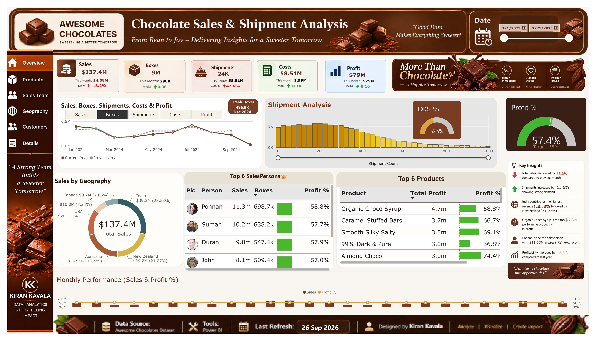
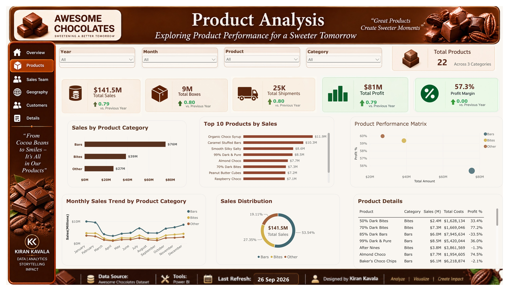
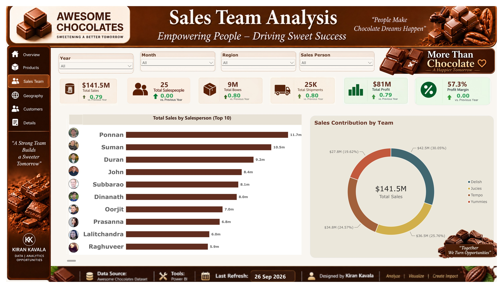
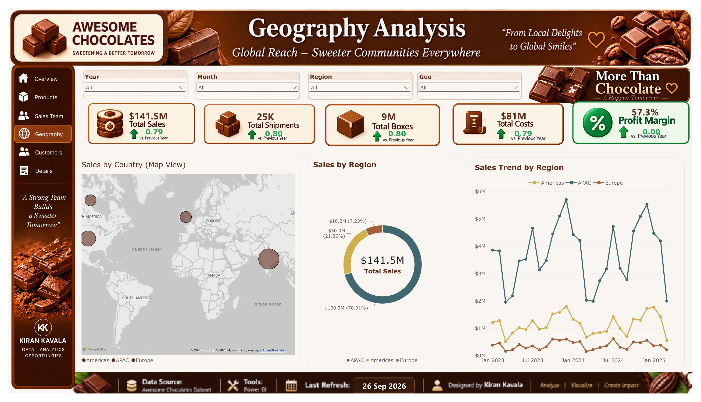
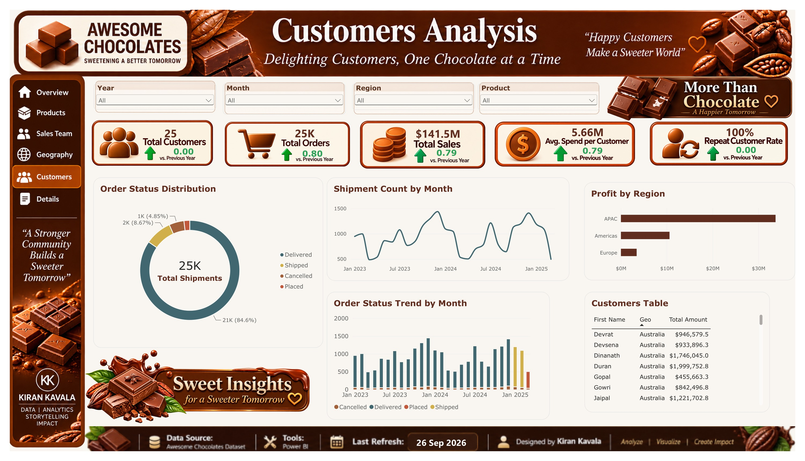
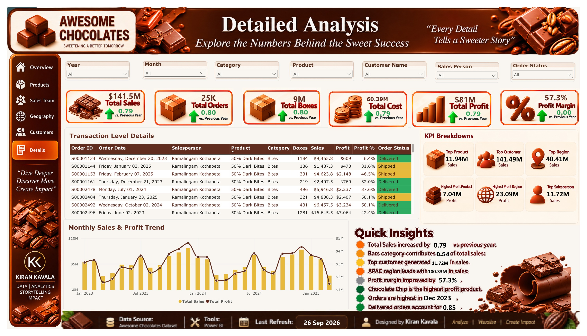

# 🍫 Chocolate Sales & Shipment Analysis — Power BI

An interactive **Power BI Business Intelligence dashboard** designed to analyze chocolate sales, shipments, products, sales team performance, geography, customers, and profitability.

This project transforms raw business data into an interactive analytical report that helps users explore business performance through KPIs, trends, comparisons, and detailed transaction-level analysis.


---

# 🚀 Project Access

## 🌐 Interactive Power BI Dashboard

👉 [Open Interactive Power BI Report](https://app.powerbi.com/reportEmbed?reportId=6159141b-68ca-4a8d-a481-3df4b5309fb9)

> The interactive Power BI report may require Power BI access/sign-in.

---

## 📥 Download Power BI Project

The complete Power BI `.pbix` file is available through the following links:

### 📦 GitHub Release

👉 [Download from GitHub Release](https://github.com/Kirankavala143/Chocolate-Sales-Analysis-PowerBI/releases/tag/v1.0.0)

### ☁️ Google Drive

👉 [Download Power BI PBIX File](https://drive.google.com/file/d/1tt4T89G_N2t4zAJNXSnjtq0gjOuePspO/view?usp=sharing)

> The `.pbix` file contains the complete interactive Power BI report, including all 6 analytical pages, data model, DAX measures, Power Query transformations, and visualizations.
>
> **Note:** The `.pbix` file requires Microsoft Power BI Desktop to open.


---

---

## 📊 Dashboard Overview

The report contains **6 analytical pages**:

### 🏠 1. Overview

Provides an executive-level summary of overall business performance, including:

- Total Sales
- Total Boxes
- Total Shipments
- Total Costs
- Total Profit
- Profitability trends
- Sales by Geography
- Salesperson performance
- Monthly performance

### 🍫 2. Products Analysis

Analyzes product-level performance, including:

- Product sales
- Product profitability
- Product categories
- Top-performing products
- Product performance trends
- Sales distribution

### 👥 3. Sales Team Analysis

Analyzes salesperson performance through:

- Sales by salesperson
- Sales contribution
- Individual performance
- Salesperson comparisons
- Performance trends

### 🌍 4. Geography Analysis

Provides geographical analysis of the business through:

- Sales by geography
- Sales by region
- Geographic distribution
- Regional sales trends
- Interactive map visualization

### 👤 5. Customers Analysis

Analyzes customer and order performance through:

- Total customers
- Total orders
- Customer sales
- Average customer spending
- Order status distribution
- Shipment trends
- Regional profitability
- Customer-level details

### 🔎 6. Detailed Analysis

Provides transaction-level analysis through:

- Order ID
- Order Date
- Salesperson
- Product
- Category
- Boxes
- Sales
- Profit
- Profit %
- Order Status
- Monthly Sales & Profit Trend
- KPI Breakdowns
- Quick Insights

---

# 🖥️ Dashboard Preview

## 🏠 Overview

[](screenshots/Overview.jpg)

---

## 🍫 Products Analysis

[](screenshots/Products.jpg)

---

## 👥 Sales Team Analysis

[](screenshots/Sales-Team.jpg)

---

## 🌍 Geography Analysis

[](screenshots/Geography.jpg)

---

## 👤 Customers Analysis

[](screenshots/Customers.jpg)

---

## 🔎 Detailed Analysis

[](screenshots/Details.jpg)

---

# 📈 Key Metrics

The dashboard provides analysis of:

- Total Sales
- Total Shipments
- Total Boxes
- Total Costs
- Total Profit
- Profit Margin
- Salesperson Performance
- Product Performance
- Regional Sales
- Customer Performance
- Order Status
- Shipment Trends
- Monthly Sales Trends
- Monthly Profit Trends

---

# 🛠️ Tools & Technologies

- **Power BI Desktop**
- **DAX**
- **Power Query**
- **Data Modeling**
- **Data Transformation**
- **Business Intelligence**
- **Data Visualization**
- **Interactive Dashboard Design**

---

# 🧠 Skills Demonstrated

This project demonstrates practical experience in:

- Data cleaning and transformation
- Data modeling
- DAX measure creation
- KPI development
- Time-based analysis
- Sales analysis
- Profitability analysis
- Customer analysis
- Product analysis
- Geographic analysis
- Interactive dashboard development
- Business storytelling
- Data visualization
- Dashboard UI/UX design

---

# 🔍 Business Analysis Areas

## Product Performance

The Products page allows users to explore product-level sales and profitability and identify products contributing to overall business performance.

## Sales Team Performance

The Sales Team page provides salesperson-level analysis and enables comparison of sales contribution and performance.

## Geographic Performance

The Geography page visualizes sales across locations and regions using maps, regional breakdowns, and time-based trends.

## Customer Performance

The Customers page provides insights into customer activity, orders, shipment behavior, order status, and regional profitability.

## Transaction-Level Analysis

The Details page allows users to explore individual transactions while comparing monthly sales and profit performance.

---

# 📊 Dashboard Design

The dashboard was designed with a consistent chocolate-inspired visual theme to maintain a clear visual identity across all pages.

The report includes:

- Custom dashboard headers
- Navigation sidebar
- KPI cards
- Interactive charts
- Tables
- Maps
- Conditional formatting
- Trend analysis
- Consistent typography
- Consistent color palette
- Page-to-page navigation

---

# 🎯 Project Objective

The objective of this project was to transform business sales and shipment data into an interactive Power BI dashboard that enables users to understand:

**Sales → Products → Sales Team → Geography → Customers → Profitability**

The project focuses on turning raw data into meaningful business insights through data modeling, DAX calculations, interactive visualizations, and dashboard design.

---

# 💡 Key Takeaways

The dashboard provides a centralized view of business performance and allows users to move from high-level KPIs to detailed transaction-level information.

Users can explore:

- Where sales are generated
- Which products contribute to sales
- How salespeople perform
- How regions perform
- How customers interact with the business
- How sales and profit change over time
- Individual transaction details

---

# 🚀 Project Highlights

- 6-page Power BI analytical report
- Interactive business dashboard
- Custom dashboard design
- KPI-driven analysis
- Product-level analysis
- Salesperson analysis
- Geographic analysis
- Customer analysis
- Transaction-level analysis
- Sales and profitability analysis
- Monthly trend analysis
- Conditional formatting
- Interactive visual storytelling

---
# 📂 Project Structure

```text
Chocolate-Sales-Analysis-PowerBI/
│
├── screenshots/
│   ├── Overview.jpg
│   ├── Products.jpg
│   ├── Sales-Team.jpg
│   ├── Geography.jpg
│   ├── Customers.jpg
│   ├── Details.jpg
│   └── README.md
│
└── README.md
```

# 👨‍💻 Author

## Kiran Kavala

**B.Tech — Computer Science Engineering (AI & ML)**

Passionate about building practical solutions using:

- Data Analytics
- Business Intelligence
- Artificial Intelligence
- Machine Learning
- Software Development

### 🔗 Connect with me

- **LinkedIn:** [Kiran Kavala](https://www.linkedin.com/in/kiran-kavala)
- **GitHub:** [KiranKavala143](https://github.com/Kirankavala143)

---

# ⭐ Project

If you found this project interesting, feel free to explore the repository and dashboard screenshots.

---

### 📌 Note

This repository contains the project documentation, dashboard screenshots, and Power BI report file for portfolio and demonstration purposes.
