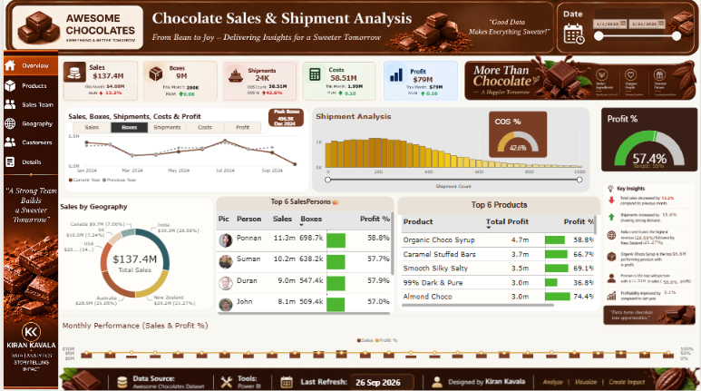
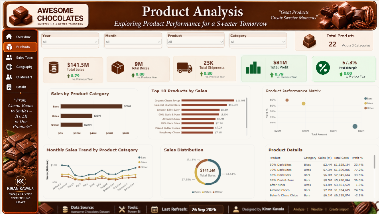
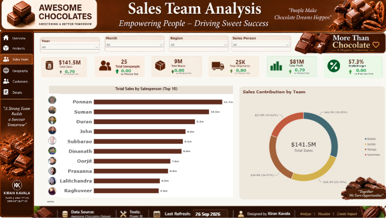
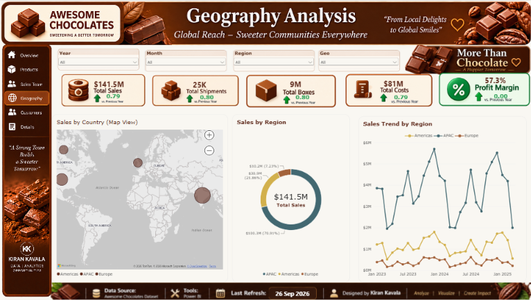
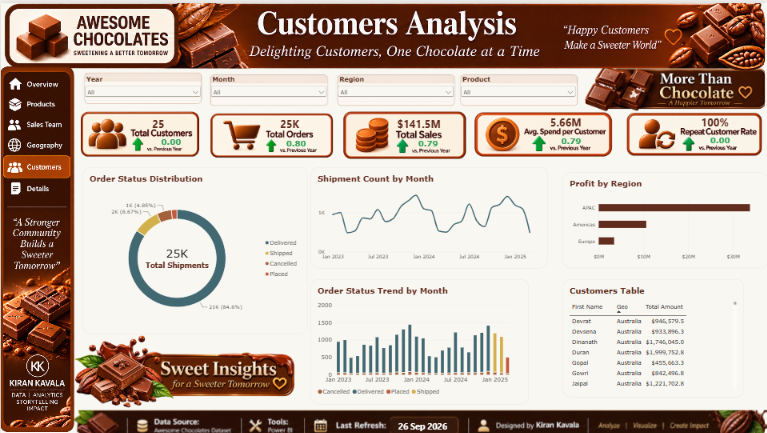
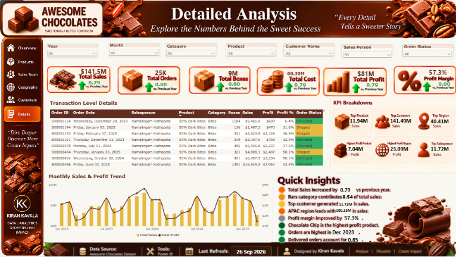

# 🍫 Chocolate Sales & Shipment Analysis — Power BI

An interactive **Power BI Business Intelligence dashboard** designed to analyze chocolate sales, shipments, products, sales team performance, geography, customers, and profitability.

This project transforms raw business data into an interactive analytical report that helps users explore business performance through KPIs, trends, comparisons, and detailed transaction-level analysis.

---

## 📊 Dashboard Overview

The report contains **6 interactive analytical pages**:

### 🏠 1. Overview
Provides an executive-level summary of overall business performance, including:

- Total Sales
- Total Boxes
- Total Shipments
- Total Costs
- Total Profit
- Profitability trends
- Sales by Geography
- Salesperson performance
- Monthly performance

### 🍫 2. Products Analysis
Analyzes product-level performance, including:

- Product sales
- Product profitability
- Product categories
- Top-performing products
- Product performance trends
- Sales distribution

### 👥 3. Sales Team Analysis
Analyzes salesperson performance through:

- Sales by salesperson
- Sales contribution
- Individual performance
- Salesperson comparisons
- Performance trends

### 🌍 4. Geography Analysis
Provides geographical analysis of the business through:

- Sales by geography
- Sales by region
- Geographic distribution
- Regional sales trends
- Interactive map visualization

### 👤 5. Customers Analysis
Analyzes customer and order performance through:

- Total customers
- Total orders
- Customer sales
- Average customer spending
- Order status distribution
- Shipment trends
- Regional profitability
- Customer-level details

### 🔎 6. Detailed Analysis
Provides transaction-level analysis through:

- Order ID
- Order Date
- Salesperson
- Product
- Category
- Boxes
- Sales
- Profit
- Profit %
- Order Status
- Monthly Sales & Profit Trend
- KPI Breakdowns
- Quick Insights

---

# 🖥️ Dashboard Preview

## 🏠 Overview



---

## 🍫 Products Analysis



---

## 👥 Sales Team Analysis



---

## 🌍 Geography Analysis



---

## 👤 Customers Analysis



---

## 🔎 Detailed Analysis



---

# 📈 Key Metrics

The dashboard provides analysis of:

- Total Sales
- Total Shipments
- Total Boxes
- Total Costs
- Total Profit
- Profit Margin
- Salesperson Performance
- Product Performance
- Regional Sales
- Customer Performance
- Order Status
- Shipment Trends
- Monthly Sales Trends
- Monthly Profit Trends

---

# 🛠️ Tools & Technologies

- **Power BI Desktop**
- **DAX**
- **Power Query**
- **Data Modeling**
- **Data Transformation**
- **Business Intelligence**
- **Data Visualization**
- **Interactive Dashboard Design**

---

# 🧠 Skills Demonstrated

This project demonstrates practical experience in:

- Data cleaning and transformation
- Data modeling
- DAX measure creation
- KPI development
- Time-based analysis
- Sales analysis
- Profitability analysis
- Customer analysis
- Product analysis
- Geographic analysis
- Interactive dashboard development
- Business storytelling
- Data visualization
- Dashboard UI/UX design

---

# 🔍 Business Analysis Areas

## Product Performance

The Products page allows users to explore product-level sales and profitability and identify products contributing to overall business performance.

## Sales Team Performance

The Sales Team page provides salesperson-level analysis and enables comparison of sales contribution and performance.

## Geographic Performance

The Geography page visualizes sales across locations and regions using maps, regional breakdowns, and time-based trends.

## Customer Performance

The Customers page provides insights into customer activity, orders, shipment behavior, order status, and regional profitability.

## Transaction-Level Analysis

The Details page allows users to drill into individual transactions while comparing monthly sales and profit performance.

---

# 📊 Dashboard Design

The dashboard was designed with a consistent chocolate-inspired visual theme to maintain a clear visual identity across all pages.

The report includes:

- Custom dashboard headers
- Navigation sidebar
- KPI cards
- Interactive charts
- Tables
- Maps
- Conditional formatting
- Trend analysis
- Consistent typography
- Consistent color palette
- Page-to-page navigation

---

# 📂 Project Structure

```text
Chocolate-Sales-Analysis-PowerBI/
│
├── screenshots/
│   ├── Overview.png
│   ├── Products.png
│   ├── Sales-Team.png
│   ├── Geography.png
│   ├── Customers.png
│   ├── Details.png
│   └── README.md
│
└── README.md
